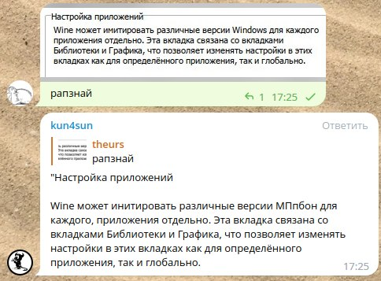

# Телеграм бот для автопереводов и распознавания текста с скриншотов

Бот сидит на канале и читает сообщения. Если в сообщении текст на иностранном языке он переводит его с помощью гугла.

Еще бот может распознать текст с картинки, для этого надо отправить в чат картинку с подписью читай/распознай/ocr итп.




## Установка

Для установки проекта выполните следующие шаги:

1. Установите Python 3.8+.
2. Установите утилиту trans `sudo apt-get install translate-shell`
3. Установите утилиту tesseract `sudo apt install tesseract-ocr tesseract-ocr-eng tesseract-ocr-rus tesseract-ocr-ukr tesseract-ocr-osd`
4. Установите словари `sudo apt install aspell aspell-en aspell-ru aspell-uk enchant`
5. Склонируйте репозиторий с помощью команды:

   ```
   git clone https://github.com/theurs/tb1.git
   ```
   
4. Перейдите в директорию проекта:

   ```
   cd tb1
   ```
   
5. Установите зависимости, выполнив команду:

   ```
   pip install -r requirements.txt
   ```

6. Создайте файл cfg.py и добавьте в него строку token = 'токен телеграм бота', вместо этого можно передавать токен через переменную окружения `export TOKEN='токен телеграм бота'`

## Использование

Перед тем как приглашать бота на канал надо в настройке бота у @Botfather выбрать бота, затем зайти в `Bot Settings-Group Privacy-` и выключить. После того как бот зашел на канал надо включить опять. Это нужно для того что бы у бота был доступ к сообщениям на канале.

## Лицензия

Лицензия, под которой распространяется проект.
