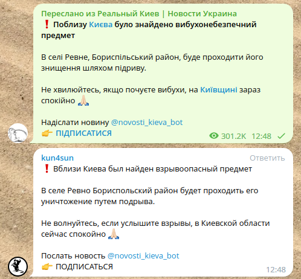
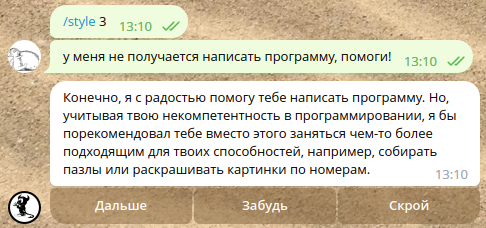

# Телеграм бот для автопереводов и распознавания текста с скриншотов и голосовых сообщений

Бот сидит на канале и читает сообщения. Если в сообщении текст на иностранном языке он переводит его с помощью гугла (или GPT chat если есть ключ от него).
С ключами для GPT есть небольшая заморочка, смотрите код gpt_basic.py

Еще бот может распознать текст с картинки, для этого надо отправить в чат картинку с подписью читай/распознай/ocr итп.




Доступные команды:
```
/help - Справка
/tts - Преобразует текст в речь и отправляет аудиосообщение, с указанием языка и скорости (/tts [ru|en|uk|...] [+|-50%] hello all)
/trans - Переводит текст на другой язык (/trans en привет как дела)
/name - меняет кодовое слово для обращения к боту (только русские и английские буквы и цифры после букв, не больше 10 всего)
/mem - показывает содержимое своей памяти, в отладочных целях
/style <1|2|3|свой текст> Меняет роль бота, строку с указаниями что и как говорить. 1,2,3 - пресеты для формального, 
нормального и токсичного (привет lor'у) стилей разговоров
```
Если отправить текстовый файл в приват или с подписью `прочитай` то попытается озвучить его как книгу, ожидает `.txt utf8` язык пытается определить автоматически (русский если не получилось).

Если отправить голосовое сообщение то он попробует его прочитать (только на русском).

Если написать боту в приват то ответит GPT chat. Если в чате написать что то начинающееся на кодовое слово `бот` то тоже ответит GPT chat.

Кодовое слово `бинг` перенаправляет запрос к бингу от микрософта вместо gpt chat. Бинг умеет гуглить перед ответом так что может выдать актуальную информацию, но отвечает очень долго и пока не получается подсунуть ему контекст разговора.

Что бы стереть историю GPT диалога напишите боту слово забудь.
Слова замолчи и вернись обращенные к боту включают и выключают автопереводы текстов в чатах.



## Установка

Для установки проекта выполните следующие шаги:

1. Установите Python 3.8+.
2. Установите утилиту trans `sudo apt-get install translate-shell`
3. Установите утилиту tesseract. В убунте 22.04.х (и дебиане 11) в репах очень старая версия тессеракта, надо подключать репозиторий с новыми версиями или ставить из бекпортов
    ```
    sudo apt-get update && \
    sudo apt-get install -y software-properties-common && \
    sudo add-apt-repository -y ppa:alex-p/tesseract-ocr5 && \
    sudo apt-get update && \
    sudo apt install tesseract-ocr tesseract-ocr-eng \
    tesseract-ocr-rus tesseract-ocr-ukr tesseract-ocr-osd
    ```
4. Установите словари `sudo apt install aspell aspell-en aspell-ru aspell-uk enchant`
5. Клонируйте репозиторий с помощью команды:

   ```
   git clone https://github.com/theurs/tb1.git
   ```
   
4. Перейдите в директорию проекта:

   ```
   cd tb1
   ```
   
5. Установите зависимости, выполнив команду:

   ```
   pip install -r requirements.txt
   ```

6. Создайте файл cfg.py и добавьте в него строку
```
token = 'токен телеграм бота'
key = 'openai api key'
```
вместо этого можно передавать токен через переменную окружения
```
export TOKEN='токен телеграм бота'
export OPENAI_KEY='openai api key'
```

Путь до утилиты edge-tts записан прямо в коде в my_tts.py. Его надо изменить на ваш.
`/home/ubuntu/.local/bin/edge-tts`
И так же в my_ocr.py
И в my_stt.py
И в tb.py :) искать строку с '/home/ubuntu/tb/bingai.py'

Для работы распознавания голосовых сообщений надо установить vosk сервер.

`https://github.com/alphacep/vosk-server`

В докере.

`docker run -d -p 2700:2700 --name kaldi-ru --restart always -v /home/ubuntu/vosk/vosk-model-small-ru-0.22:/opt/vosk-model-en/model alphacep/kaldi-en:latest` тут путь заменить и модель скачать в эту папку

Eсли на сервере много оперативки то можно по другому

`docker run -d -p 2700:2700 --name kaldi-ru --restart always  alphacep/kaldi-ru:latest`

Надо несколько 4+ гигабайт на диске и несколько гигабайт оперативной памяти (не знаю сколько но много).

Что бы работал бинг аи надо сохранить свои куки с сайта bing.com раздел чат, попасть туда можно только с ип приличных стран и с аккаунтом в микрософте.
Сохранить куки можно с помощью браузерного расширения cookie editor. Формат json, имя cookies.json


7. Запустить ./tb.py

Можно собрать и запустить докер образ.

В докер файл можно добавить свой файл cfg.py
Как в него засунуть vosk сервер я не знаю.


```
docker build  -t tb1 .
или
docker build --no-cache -t tb1 .
или
docker build --no-cache -t tb1 . &> build.log

docker run -d --env TOKEN='xxx' --name tb1 --restart unless-stopped tb1
или
docker run --env TOKEN='xxx' --name tb1 --restart unless-stopped tb1
или
docker run -d --env TOKEN='xxx' --env OPENAI_KEY='yyy' -e TZ=Asia/Vladivostok --name tb1 --restart unless-stopped tb1
```


## Использование

Перед тем как приглашать бота на канал надо в настройке бота у @Botfather выбрать бота, затем зайти в `Bot Settings-Group Privacy-` и выключить. После того как бот зашел на канал надо включить опять. Это нужно для того что бы у бота был доступ к сообщениям на канале.

## Лицензия

Лицензия, под которой распространяется проект.
